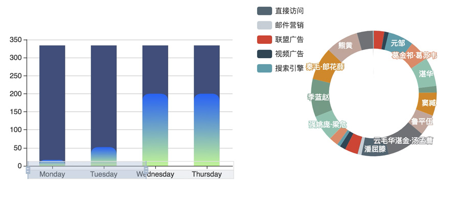

# echarts-soap
  

use echarts-soap after

  

this demo just use 4 method

```
echartsSoap.registerPreprocessor("innerPieLabelMinPercent","5%");
echartsSoap.registerPreprocessor("barShadow",'#3f4b78');
echartsSoap.registerRenderAfter("dataZoomFitWidth",function(dom,orginalOption){
            return orginalOption.series[0].data.length > 4
});
echartsSoap.registerPreprocessor("bar.series.barMinHeight",10);
```

## echarts-soap 是什么？
   echarts-soap使用echarts官方文档尚未提及的（截止3.7.2版本）API，使用*Preprocessor*来对echarts配置项进行修改，用于对echarts实例配置项的批量调整。可能是对某类图表的一些涉及外观的参数进行统一的调整。

### Preprocessor 是什么？
   Preprocessor是echarts实例在接收到配置参数option后，渲染图表之前的中间过程中执行的，此处可对option作任意调整。通过`echarts.registerPreprocessor`接口注册后每个echarts实例在渲染图表之前都会执行。

### echarts-soap API  
echartsSoap 为UMD封装，script标签直接引入会在window下暴露 `echartsSoap`变量。

#### `echartsSoap.render (id, option)`
传入div或canvas id 和option来渲染echarts,此方法为官方使用方式的便捷版本，同时避免开发人员复制粘贴代码而使交互过程中多次echarts.init 同一元素。


#### `echartsSoap.registerPreprocessor (key , value)`
注册处理器，`key` 可以是`echartsSoap`已经预置的处理器,也可以是通过`echartsSoap.extendPreprocessorsMap`扩展而来的处理器，或者是像demo.js中的'bar.series.barMinHeight'包含<series.type>.<迭代层级>.<属性>三部分，其中**迭代层级**除了series,还可以是data,表示在迭代过程中想要调整每个series或每个data里的单个元素的哪个属性。

`value`可以是基本类型或者Object,Array根据类型不同采用直接赋值或者｀echarts.util.extend｀

#### `echartsSoap.registerRenderAfter (key, value)`
有些操作需要渲染之后才能有效执行(至少从官方文档很难获取需要的变量)，比如预置的`dataZoomFitWidth`，将根据容器宽度调整dataZoom结束位置，避免出现显示的柱状条很多而分类轴受限于label文字长度只能展示少量的label。  

｀value｀ 目前是根据不同需要采用不同的类型，比如`dataZoomFitWidth` 接受一个回调函数作为`value`,返回一个bool值以决定是否应用此处理器，回调函数的上下文为 echartsInstance, 参数为dom, orginalOption。


#### `echartsSoap.traverse (option, key , value)`
option 在传入echarts构造器之前你可以通过此方法调整将要传入给echarts构造器的option进行修改，`key` `value`规则同 `echartsSoap.registerPreprocessor (key , value)`
你可以传入**Preprocessor**因为跟**Preprocessor**一样，此时echarts还没有渲染。不同的是这里修改的是将要生成的单个实例的option。

#### `echartsSoap.extendPreprocessorsMap (obj)`

接受一个对象来扩展**PreprocessorsMap**,<preprocessorName>为自定义的名称，即`echartsSoap.registerPreprocessor`时传入的`key`
`chartType` 将要应用的series类型  
`level` **迭代层级**  
`handle` 处理逻辑  
`handle`的`value`为`echartsSoap.registerPreprocessor`时传入的`value`
optionOrData取决于`level`即在循环series时调用还是单个series的data时调用。

```
{
    preprocessorName:{
    chartType: 'bar',
    level: 'series',
    handle: function(value) {
        return function(optionOrData) {
        }
    }

    }
}
```